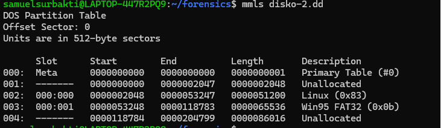
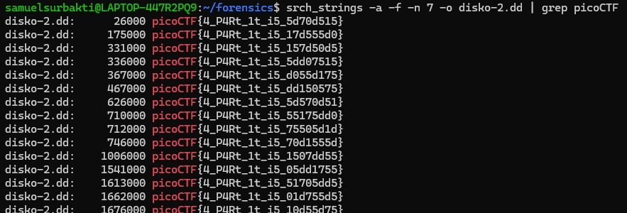

# DISKO 2

DESKRIPSI 
Can you find the flag in this disk image? The right one is Linux! One wrong step and its all gone!
Download the disk image [here]

OVERVIEW
- mmls, melihat tabel partisi dari disk image, bekerja di tingkat partisi
- srch_strings, mengekstrak printable char dari disk image
- mmcat, mengekstrak isi dari partisi 

SOLUSI

hal pertama yang kita lakukan adalah melihat partisi disk image dengan mmls

dari deskripsi yang diberikan kita coba untuk menggunakan search_strings untuk melihat
semua printable charachter dari semua partisi yang kemungkinan akan memberikan flag.

ternyata disk menyimpan banyak flag acak.

tapi setelah membaca deskripsi, kita diberitahu bahwa flagnya akan ada di partisi yang berlabel Linux.

oleh karena itu, kita menggunakan mmcat untuk mengekstrak partisinya  

FLAG

picoCTF{4_P4Rt_1t_i5_055dd175}
