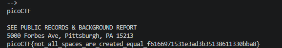

# White Spaces

DESKRIPSI 
I stopped using YellowPages and moved onto WhitePages... but [the page they gave me](<whitepages.txt>)
is all blank!

OVERVIEW
-  Whitespace encoding adalah konsep yang tiap bit diwakilkan oleh em space (\xe28083) sebagai bit 0.

    sedangkan space (\x20) sebagai bit 1. 

SOLUSI

hal pertama yang kita lakukan adalah melihat jenis file menggunakan command 'file'

ternyata filenya berisikan sebuah unicode text, bukan ascii text sehingga mungkin ada beberapa karakter yang unik

selanjutnya saya untuk membuka filenya dengan 'cat', tetapi isinya kosong

saya lanjut untuk merlihat isi filenya langsung dengan 'xxd' ternyata filenya hanya mempunyai 4 byte yang terus berulang 

\xe2 \x80 \x83 \x20

Saya mencoba mengotak-atik file ini, pada akhirnya saya mencari apa arti pola ini gemini

ternyata pola ini sangat identik dengan whitespace encoding

dengan kode [python](solution.py), kita bisa mengdecode file tersebut

FLAG

picoCTF{not_all_spaces_are_created_equal_f6166971531e3ad3b35138611330bba8}

